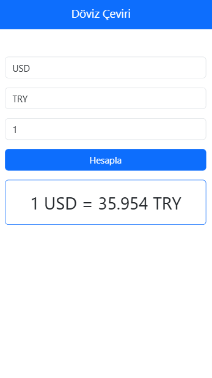

# 💱 Döviz Çeviri Uygulaması

Kullanıcıların farklı döviz kurları arasında dönüşüm yapmasını sağlayan basit bir döviz çeviri projesi.

## 📌 Proje Konusu

Bu proje, kullanıcıların güncel döviz kurlarını kullanarak bir para biriminden diğerine kolayca dönüşüm yapabilmesini sağlar. Kullanıcılar, belirli bir miktarı seçerek döviz çevrimini anlık olarak görüntüleyebilir.

## 🎯 Neden Geliştirildi?

Bu uygulamayı geliştirme motivasyonum:  
✅ API kullanımı ve dış veri kaynaklarından veri çekme konusunda deneyim kazanmak  
✅ JavaScript ile **asenkron işlemler (fetch API)** kullanarak veri çekme pratiği yapmak  
✅ **Bootstrap** ile responsive bir kullanıcı arayüzü tasarlamak  
✅ Gerçek dünya projelerine benzer bir döviz çeviri uygulaması oluşturmak  

## 🚀 Ne Öğrendim?

Bu projeyi geliştirirken aşağıdaki konularda bilgi ve deneyim kazandım:  

- **JavaScript Fetch API** ile API'den veri çekme  
- **Asenkron işlemler** ve **Promise** yapısını kullanma  
- **DOM Manipülasyonu** ile kullanıcıdan giriş alma ve sonucu ekrana yazdırma  
- **Bootstrap 5** ile tasarım oluşturma  

## 🔥 Özellikler

✅ Güncel döviz kurlarını kullanarak anlık çeviri yapma  
✅ Kullanıcı dostu ve mobil uyumlu arayüz  
✅ Dropdown (listeler) ile para birimi seçme kolaylığı  
✅ API'den döviz kodlarını dinamik olarak çekme  
✅ Bootstrap ile tasarım  

## 🔧 Kullanılan Teknolojiler

- **HTML5** - Yapıyı oluşturmak için  
- **CSS3 (Bootstrap 5)** - Responsive ve şık tasarım için  
- **JavaScript (ES6+)** - API'den veri çekme ve işleme  
- **ExchangeRate-API** - Güncel döviz kurları için  

## 🖥 Ekran Görüntüleri

